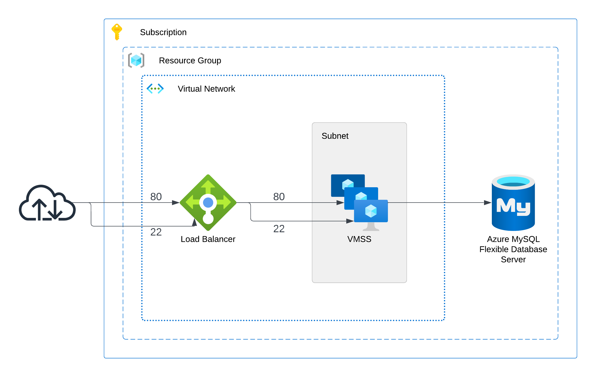

# Phonebook Application deployed on Azure Load Balancer with VMSS and MySQL Flexible Database Service using Terraform

## Description

The Phonebook Application aims to create a phonebook application in Python and deployed as a web application with Flask on Azure Load Balancer with VMSS Instances and MySQL Flexible Database Service using Terraform.

## Project Architecture

## Notes

- Application needs the endpoint of the `dbserver`. We are using Terraform to create a file on GitHub and reading the `dbserver endpoint` from this file within the application.
- We are providing the `repo name` and `vmss username` to the `custom-data.sh` file dynamically.